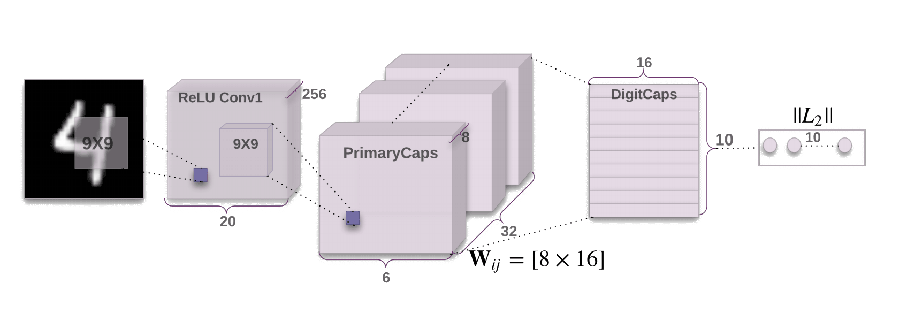

# Awesome Capsule Networks 

A curated list of awesome resources related to capsule networks maintained by [AI Summary](http://aisummary.com).

## Contributing
Please [pull a request](https://github.com/aisummary/awesome-capsule-networks/pulls) if you are aware of additional resources.

Your feedback and contributions are always welcome!

## Sharing
- [Share on Twitter](http://twitter.com/home?status=http://github.com/sekwiatkowski/awesome-capsule-networks)
- [Share on Facebook](http://www.facebook.com/sharer/sharer.php?u=http://github.com/sekwiatkowski/awesome-capsule-networks)
- [Share on Google Plus](http://plus.google.com/share?url=http://github.com/sekwiatkowski/awesome-capsule-networks)
- [Share on LinkedIn](http://www.linkedin.com/shareArticle?mini=true&url=http://github.com/sekwiatkowski/awesome-capsule-networks)

## Table of Contents
- [Papers](#papers)
  - [Papers by Geoffrey Hinton and colleagues](#papers-by-hinton-et-al)
  - [Under review](#under-review)
  - [Preprints](#preprints)  
- [Videos](#videos)
- [Blogs](#blogs)
- [Dynamic routing implementations](#dynamic-routing-implementations)
  - [Official implementation](#official-implementation)  
  - [Chainer](#chainer)  
  - [CNTK](#cntk)
  - [Keras](#keras)
  - [Matlab](#matlab)
  - [MXNet](#mxnet)
  - [PyTorch](#pytorch)
  - [R](#r)
  - [TensorFlow](#tensorflow)  
  - [Torch](#torch)
- [EM routing implementations](#em-routing-implementations)
  - [PyTorch](#em-routing-pytorch)
  - [TensorFlow](#em-routing-tensorflow)  
- [Other resources](#other-resources)  
- [License](#license)

## Papers

### Papers by Hinton et al.
- [Matrix capsules with EM routing](https://openreview.net/forum?id=HJWLfGWRb) - Hinton, G. E., Sabour, S. and Frosst, N. (2018)
- [Dynamic Routing Between Capsules](https://arxiv.org/abs/1710.09829) - Sabour, S., Frosst, N. and Hinton, G.E. (2017)
- [Transforming Auto-encoders](http://www.cs.toronto.edu/~fritz/absps/transauto6.pdf) - Hinton, G. E., Krizhevsky, A. and Wang, S. D. (2011)
- [A parallel computation that assigns canonical object-based frames of reference.](http://www.cs.toronto.edu/~fritz/absps/object-based81.pdf) - Hinton, G.E. (1981)
- [Shape representation in parallel systems](http://www.cs.toronto.edu/~fritz/absps/shape81.pdf) - Hinton, G.E. (1981)
- [Optimizing Neural Networks that Generate Images](http://www.cs.toronto.edu/~tijmen/tijmen_thesis.pdf) - Tijmen Tieleman's disseration

### Other papers
- [Multi-level Dense Capsule Networks](https://github.com/ssrp/Multi-level-DCNet) - S. S. R. Phaye, A. Sikka, A. Dhall and D. R. Bathula (2018)

### Under review
- [An Optimization View on Dynamic Routing Between Capsules](https://openreview.net/forum?id=HJjtFYJDf) - Wang, D., Liu, E. (2018)
- [Spectral Capsule Networks](https://openreview.net/forum?id=ByVJlqR8G) - Bahadori, M. T. (2018)

### Preprints
- [Capsule Network Performance on Complex Data](https://arxiv.org/pdf/1712.03480.pdf) - Xi, E., Bing, S. and Jin, Y. (2017)
- [Accurate reconstruction of image stimuli from human fMRI based on the decoding model with capsule network architecture](https://arxiv.org/ftp/arxiv/papers/1801/1801.00602.pdf) - Qiao, K., Zhang, C., Wang, L., Yan, B., Chen, J., Zeng, L. and Tong, L. (2018)
- [CapsuleGAN: Generative Adversarial Capsule Network](https://arxiv.org/pdf/1802.06167.pdf) - Jaiswal, A., AbdAlmageed, W. and Natarajan, P. (2018)
- [Brain Tumor Type Classification via Capsule Networks](https://arxiv.org/pdf/1802.10200.pdf) - Afshar, Parnian., Mohammadi, A., and Plataniotis, K. N. (2018)
- [Sentiment Analysis by Capsules](https://www.researchgate.net/profile/Aixin_Sun/publication/323257127_Sentiment_Analysis_by_Capsules/links/5a8a3be5aca272017e621e81/Sentiment-Analysis-by-Capsules.pdf) - Wang, Y., Sun, A., Han, J., Liu, Y. and Zhu, X. (2018)
- [Capsules for Object Segmentation](https://arxiv.org/pdf/1804.04241.pdf) - LaLonde, R. and Bagci, U. (2018)
- [Sparse Unsupervised Capsules Generalize Better](https://arxiv.org/abs/1804.06094) - Rawlinson, D., Ahmed, A. and Kowadlo, G. (2018)
- [VideoCapsuleNet: A Simplified Network for Action Detection](https://arxiv.org/abs/1805.08162) - Duarte, K., Rawat, Y.S. and Shah, M. (2018)
- [Fast CapsNet for Lung Cancer Screening](https://arxiv.org/abs/1806.07416) - Mobiny, A. and Nguyen, H.V. (2018)

## Videos
- [Geoffrey Hinton's talk: What is wrong with convolutional neural nets?](https://www.youtube.com/watch?v=rTawFwUvnLE) - Talk given at MIT. Brain & Cognitive Sciences - Fall Colloquium Series.
- [Capsule Networks (CapsNets) – Tutorial](https://www.youtube.com/watch?v=pPN8d0E3900) - "This is an amazingly good video. I wish I could explain capsules that well." (Geoffrey Hinton)
- [Capsule networks: overview](https://www.youtube.com/watch?v=YqazfBLLV4U) - Overview of Hinton's capsule networks, including vector and matrix capsules.
- [Overview of awesome videos](http://www.aisummary.com/blog/watch-three-videos-understand-capsule-networks/)

## Blogs
- Understanding Hinton’s Capsule Networks - Max Pechyonkin's series
  - [Part 1: Intuition](https://medium.com/ai%C2%B3-theory-practice-business/understanding-hintons-capsule-networks-part-i-intuition-b4b559d1159b)
  - [Part 2: How Capsules Work](https://medium.com/ai%C2%B3-theory-practice-business/understanding-hintons-capsule-networks-part-ii-how-capsules-work-153b6ade9f66)
  - [Part 3: Dynamic Routing Between Capsules](https://medium.com/ai%C2%B3-theory-practice-business/understanding-hintons-capsule-networks-part-iii-dynamic-routing-between-capsules-349f6d30418)
  - [Part 4: CapsNet Architecture](https://medium.com/@pechyonkin/part-iv-capsnet-architecture-6a64422f7dce)
- [Uncovering the Intuition behind Capsule Networks and Inverse Graphic](https://hackernoon.com/uncovering-the-intuition-behind-capsule-networks-and-inverse-graphics-part-i-7412d121798d) - Tanay Kothari's long-form tutorial
- [A Visual Representation of Capsule Connections in Dynamic Routing Between Capsules](https://medium.com/@mike_ross/a-visual-representation-of-capsule-network-computations-83767d79e737) - Mike Ross's diagram
- [What is a CapsNet or Capsule Network?](https://hackernoon.com/what-is-a-capsnet-or-capsule-network-2bfbe48769cc) - Debarko De's tutorial with commented code
- [Capsule Networks Are Shaking up AI — Here’s How to Use Them](https://hackernoon.com/capsule-networks-are-shaking-up-ai-heres-how-to-use-them-c233a0971952) - Nick Bourdakos's introduction
- [Understanding Capsule Networks — AI’s Alluring New Architecture](https://medium.freecodecamp.org/understanding-capsule-networks-ais-alluring-new-architecture-bdb228173ddc) - Nick Bourdakos's deeper explanation about capsules with the visualization tool
- [Capsule Networks Explained](https://kndrck.co/posts/capsule_networks_explained/) - Kendrick Tan's explanation
- [Understanding Dynamic Routing between Capsules (Capsule Networks)](https://jhui.github.io/2017/11/03/Dynamic-Routing-Between-Capsules/): Jonathan Hui's tutorial with commented code
- [Matrix capsules with EM routing](https://blog.acolyer.org/2017/11/14/matrix-capsules-with-em-routing/) - Adrian Colyer's post on EM routing
- [Cuda, TensorFlow and Capsule Networks](http://jostosh.github.io/posts/capscuda.html) - Jos van de Wolfshaar's post on custom TensorFlow Ops with CUDA support for the prediction operation
- [Capsule Networks: A Glossary](http://www.aisummary.com/blog/capsule-networks-glossary/) - Sebastian Kwiatkowski's glossary
- [Overview of awesome articles](http://www.aisummary.com/blog/three-complementary-capsule-network-tutorials/)

## Dynamic routing implementations

### Official implementation
- [Sarasra/models](https://github.com/Sarasra/models) - The official models used in [Dynamic Routing Between Capsules](https://arxiv.org/abs/1710.09829)

### Chainer
- [soskek/dynamic_routing_between_capsules](https://github.com/soskek/dynamic_routing_between_capsules)

### CNTK
- [Southworkscom/CapsNet-CNTK](https://github.com/southworkscom/CapsNet-CNTK)

### Keras
- [XifengGuo/CapsNet-Keras](https://github.com/XifengGuo/CapsNet-Keras)
- [gusgad/capsule-GAN](https://github.com/gusgad/capsule-GAN)

### Matlab
- [yechengxi/LightCapsNet](https://github.com/yechengxi/LightCapsNet)

### MXNet
- [Soonhwan-Kwon/capsnet.mxnet](https://github.com/Soonhwan-Kwon/capsnet.mxnet)

### PyTorch
- [gram-ai/capsule-networks](https://github.com/gram-ai/capsule-networks)
- [higgsfield/Capsule-Network-Tutorial](https://github.com/higgsfield/Capsule-Network-Tutorial)

### R
- [dfalbel/capsnet](https://github.com/dfalbel/capsnet)

### TensorFlow
- [naturomics/CapsNet-Tensorflow](https://github.com/naturomics/CapsNet-Tensorflow)
- [bourdakos1/capsule-networks](https://github.com/bourdakos1/capsule-networks)
- [JunYeopLee/capsule-networks](https://github.com/JunYeopLee/capsule-networks)
- [jaesik817/adv_attack_capsnet](https://github.com/jaesik817/adv_attack_capsnet)
- [thibo73800/capsnet-traffic-sign-classifier](https://github.com/thibo73800/capsnet-traffic-sign-classifier)

### Torch
- [mrkulk/Unsupervised-Capsule-Network](https://github.com/mrkulk/Unsupervised-Capsule-Network)

## EM routing implementations
<h3 id="em-routing-pytorch">PyTorch</h3>
<ul>
  <li><a href="https://github.com/shzygmyx/Matrix-Capsules-pytorch">shzygmyx/Matrix-Capsules-pytorch</a></li>
</ul>

<h3 id="em-routing-tensorflow">TensorFlow</h3>
<ul>
  <li><a href="https://github.com/gyang274/capsulesEM">gyang274/capsulesEM</a></li>
  <li><a href="https://github.com/www0wwwjs1/Matrix-Capsules-EM-Tensorflow">www0wwwjs1/Matrix-Capsules-EM-Tensorflow</a></li>
</ul>

## Other resources
- [Capsule Networks discussion](https://www.facebook.com/groups/1830303997268623) - A Facebook discussion group
- [loretoparisi/CapsNet](https://github.com/loretoparisi/CapsNet) - Loreto Parisi's list of capsule network resources
- [Will capsule networks replace neural networks?](https://www.quora.com/Will-capsule-networks-replace-neural-networks) - A question discussed on Quora
- [Capsule Networks HW](https://github.com/vkantor/Data_Mining_in_Action_2018_Spring/blob/master/trends/data_2/CapsuleNetwork_HW.ipynb) - Homework assignwork in a Python Notebook format
- [CapsNet-Tensorflow](https://gitter.im/CapsNet-Tensorflow/Lobby) - CapsNet-Tensorflow's gitter.im group

## License

This work is licensed under a [Creative Commons Attribution 4.0 International License](https://creativecommons.org/licenses/by/4.0/).
